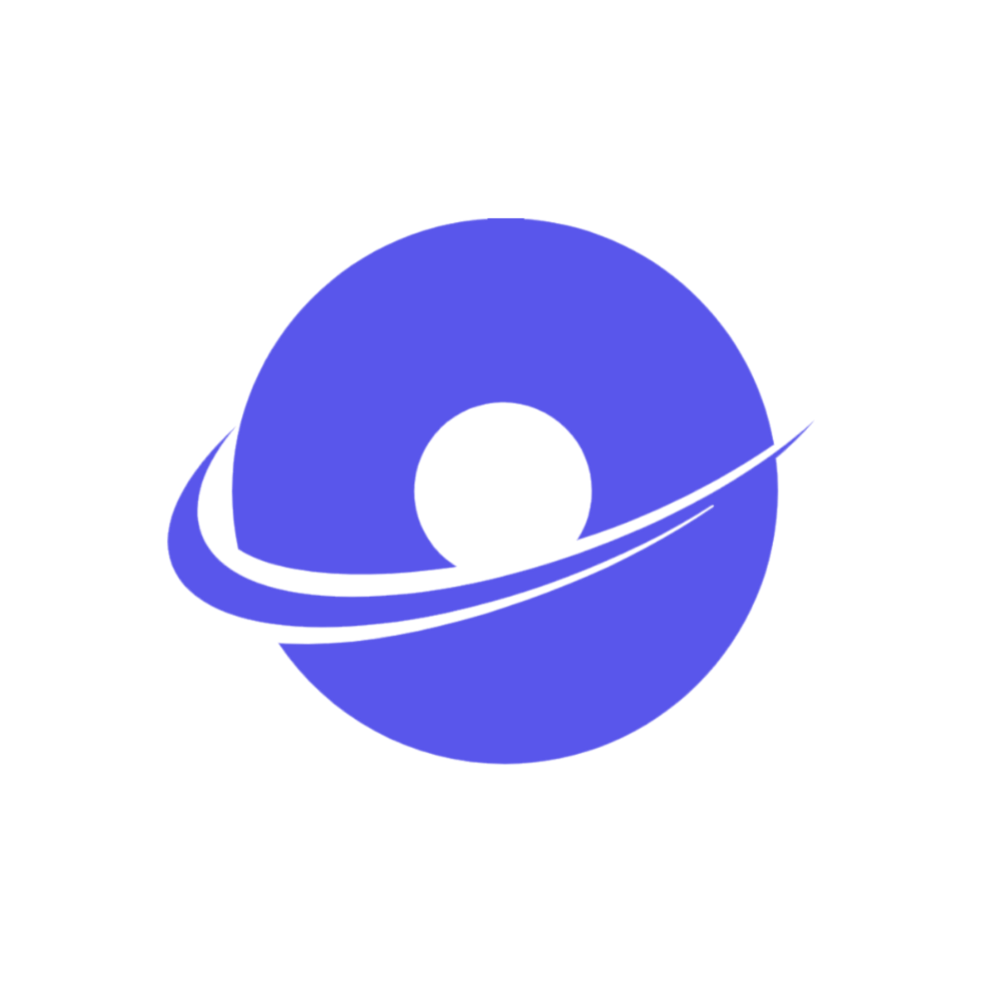

<div align="center">
  

  <p align="center">
  
</p>
</div>

<div align="center">

<a href="https://github.com/Vixsry/viks-animation/blob/main/LICENSE" target="_blank">
  
</a>
<a href="https://example.com/dashboard" target="_blank">
  
</a>

</div>


<div align="center">
  <strong>Lightweight JavaScript library for smooth and engaging scroll animations</strong>
</div>

<div align="center">
  <sub>Created with ❤️ by
  <a href="https://github.com/Vixsry">Vixsry</a>
</div>


<div align="center">
  <strong>INTRODUCTION</strong>
</div>


<h1><strong>What is VIKS Animation?</strong></h1>
VIKS Animation is a modern animation library designed to make websites and applications more dynamic with minimal effort. It is beginner-friendly and suitable for professionals, offering both basic and advanced configuration options to cater to diverse animation needs.

🎯 **Core Features**
- Smooth Scroll Animation
- Number Animation
- 3D Transformations
- Multiple Easing Functions
- Cross-Browser Support

🛠️ **Technical Highlights**
- Zero Dependencies
- Lightweight (~12KB gzipped)
- High Performance
- Mobile-First Design
- TypeScript Support

🎨 **Animation Types**
- Fade Effects
- Slide Animations
- Scale Transformations
- 3D Rotations
- Custom Animations

---

[](mailto:viksry@proton.me)
[](https://www.linkedin.com/in/viksry)
[](https://www.instagram.com/viksry12)
[](https://www.tiktok.com/@viksry)
[](https://www.threads.net/@viksry12)
[](https://www.facebook.com/share/19aKzAtBeZ/)

</div>

<div align="center"><strong>AVAILABLE ANIMATIONS</strong></div>

<div align="center">

[](#fade-animations)
[](#flip-animations)
[](#slide-animations)
[](#zoom-animations)
[](#Shake-Animation)
[](#Spin-Animation)
[](#Bounce-Animation)

</div>

---

<div align="center"><strong>INSTALLATION</strong></div>


<div align="center">

[](#npm)
[](#yarn)
[](#cdn)

</div>

Get started by including production-ready Viks Animation CSS and JavaScript via CDN without any build steps required.

<div><strong>1.Create a new file index.html in the root of your project</strong></div>

## EXAMPLE
```html
<!doctype html>
<html lang="en">
  <head>
    <meta charset="utf-8">
    <meta name="viewport" content="width=device-width, initial-scale=1">
    <title>Viks Animation</title>
  </head>
  <body>
    <h1>Hello, world!</h1>
  </body>
</html>
```

<div><strong>2.Include Viks Animation CSS and JS</strong></div>

Place a <link> tag inside the <head> for our CSS, and a <script> tag for our JavaScript bundle (including Popper to position the dropdown, popper, and tooltip) before the closing </body>.

<div align="left">
  <strong>EXAMPLE</strong>
</div>


```html
<!doctype html>
<html lang="en">
  <head>
    <meta charset="utf-8">
    <meta name="viewport" content="width=device-width, initial-scale=1">
    <title>Viks Animatiom demo</title>
    <link rel="stylesheet" href="https://cdn.jsdelivr.net/npm/viks-a@latest/dist/viks.min.css">
  </head>
  <body>
    <h1 data-viks="fade-up">Hello, world!</h1>
    <h2 data-viks="fade-down">Hello, world!</h2>
    <h3 data-viks="fade-right">Hello, world!</h3>
    <h4 data-viks="fade-left">Hello, world!</h4>
    <h5 data-viks="zoom-out">Hello, world!</h5>
    <h6 data-viks="zoom-in">Hello, world!</h6>
    <script src="https://cdn.jsdelivr.net/npm/viks-a@latest/dist/viks.min.js"></script>
  </body>
</html>
```

<div><strong>3.Open the page in your preferred browser to view your Viks Animation page</strong></div>

Now you can start building with Viks Animation by creating your own Animations , adding dozens of animations , and taking advantage of our official examples .

### CDN
```html
<!-- Stylesheet -->
<link rel="stylesheet" href="https://cdn.jsdelivr.net/npm/viks-a@latest/dist/viks.min.css">
```

```html
<!-- JavaScript -->
<script src="https://cdn.jsdelivr.net/npm/viks-a@latest/dist/viks.min.js"></script>
```

<div><strong>4.Install via package manager</strong></div>
Install the Viks Animation source Sass and JavaScript files via npm, YARN, or Composer.

### NPM
```bash
npm install viks-a --save
```

### YARN
```bash
yarn add viks-a
```


<h2 align="center">MANUAL INSTALLATION</h2>

1. Download the JavaScript and CSS files:
   - `viks.css`
   - `viks.js`

2. Add them to your HTML as shown below:
```html
<!-- CSS -->
<link rel="stylesheet" href="path/to/viks.css">

<!-- JAVA SCRIPT -->
<script src="path/to/viks.js"></script>
```


<h2 align="center">INITIALIZATION</h2>

```javascript
// VIKS SCROLL ANIMATION
VIKS.init()

// VIKS NUMBER ANIMATION
VIKSNumber.init();

// VIKS 3D ANIMATION
const viks3D = new Viks3D(); 
viks3D.addShadow();
viks3D.addParallax(20);
```

```javascript
VIKS.init({
  thresholdTop: 0.2, // Set threshold when element appears at the top of the viewport
  thresholdBottom: 0.2, // Set threshold when element appears at the bottom of the viewport
  disable: false, // Disable animation if set to true
  startEvent: 'load', // Wait until the page is fully loaded
  animatedClassName: 'viks-animate', // Add animation class to animated elements
  initClassName: 'viks-init', // Class added to initialized elements
  useClassNames: false, // Enable or disable the use of CSS classes
  throttleDelay: 100, // Set delay time for throttle on scroll
  debounceDelay: 50, // Set delay time for debounce on resize
  offset: 120, // Add offset distance from the viewport
  delay: 0, // Delay animation after element appears
  duration: 800, // Animation duration
  easing: 'ease-in-out', // Default easing function
  once: false, // Animation runs only once
  mirror: true, // Display animation in both directions (mirroring)
  animateTop: false,  // Turn off all scroll-up animations
  animateBottom: true // Enable scroll-down animations
});
```

---

<h2 align="center">USAGE</h2>

---

<p align="center">ON SCROLL ANIMATION</p>

```html
<!-- Basic Usage
=====================-->
<div data-viks="fade-up">
  VIKS CONTENT
</div>
```

```html
<!-- Animation Based on Screen Size
================================-->
<div data-viks="fade-up"
     data-viks-desktop="zoom-in"
     data-viks-tablet="fade-left"
     data-viks-mobile="fade-down">
    VIKS CONTENT
</div>
```


```html
<!-- Control Delay 1
=====================-->
<div data-viks="fade-up" data-viks-delay="1000">
  VIKS CONTENT
</div>
```

```html
<!-- Control Delay 2
=====================-->
<div data-viks="fade-up delay-1000">
  VIKS CONTENT
</div>
```

```html
<!-- Control Duration 1
======================-->
<div data-viks="fade-up" data-viks-duration="2000">
  2 seconds duration
</div>
```

```html
<!-- Control Duration 2
======================-->
<div data-viks="fade-up duration-2000">
  2 seconds duration
</div>
```

```html
<!-- DISABLE SCROLL UP ANIMATION
=====================================================-->
<div data-viks="fade-up" data-viks-animation-top="off">
  No animation on upscroll
</div>

<!-- DISABLE SCROLL DOWN ANIMATION
===========================================================-->
<div data-viks="fade-up" data-viks-animation-bottom="off">
  No animation on downscroll
</div>
```

```html
<!-- COMBINE MULTIPLE ATTRIBUTES 
================================================================-->
<div data-viks="fade-up delay-1000 duration-2000">
  Multiple attributes combination
</div>
```

```html
<!-- Easing
============-->
<div data-viks="fade-up" data-viks-easing="ease-out">
  Ease-out easing
</div>
```

<details>
  <summary>Available Easing Functions</summary>

  - `linear`
  - `ease`
  - `ease-in`
  - `ease-out`
  - `ease-in-out`
  - `ease-in-back`
  - `ease-out-back`
  - `ease-in-out-back`
  - `ease-in-sine`
  - `ease-out-sine`
  - `ease-in-out-sine`
  - `ease-in-quad`
  - `ease-out-quad`
  - `ease-in-out-quad`
  - `ease-in-cubic`
  - `ease-out-cubic`
  - `ease-in-out-cubic`
  - `ease-in-quart`
  - `ease-out-quart`
  - `ease-in-out-quart`
  - `ease-elastic`
  - `ease-bounce`
  - `ease-in-expo`
  - `ease-out-expo`
  - `ease-in-out-expo`
  - `ease-in-circ`
  - `ease-out-circ`
  - `ease-in-out-circ`

</details>

___

<p align="center">3D ANIMATION</p>

---

```html
<!-- USAGE OF 3D ANIMATION
===============================-->
<div data-viks="3D">
    <h2>Examples</h2>
    <p>Examples</p>
</div>
```

---

<p align="center">NUMBER ANIMATION</p>

---

```html
<!-- USAGE OF NUMBER ANIMATION
===========================================================-->
<span data-viks="type-nbr duration-1000 fps-120">1000</span>
<span data-viks="type-nbr">1000</span>
```
or
```html
<!-- USAGE COMBINATION OF FPS, DURATION, AND ANIMATION CONTROL
===========================================================-->
<span data-viks="type-nbr duration-2000 fps-60 bottom-off">2000</span>
```

### EVENT CALLBACK

```javascript
// Initialize VIKS with callbacks
VIKS.init()
  .on('beforeInit', (event) => {
    console.log('Before initialization:', event.timestamp);
  })
  .on('afterAnimate', (event) => {
    console.log('Element animated:', event.element);
  })
  .on('onScroll', (event) => {
    console.log('Scroll position:', event.scrollY);
  });

// Remove specific callback
const scrollHandler = (event) => {
  console.log('Scroll:', event.scrollY);
};

VIKS.on('onScroll', scrollHandler);
// Later...
VIKS.off('onScroll', scrollHandler);
```

---

### Bounce Animation
- `bounce`
- `bounce-up`
- `bounce-down`
- `bounce-left`
- `bounce-right`


### Fade Animations
- `fade`
- `fade-up`
- `fade-down`
- `fade-left`
- `fade-right`
- `fade-up-right`
- `fade-up-left`
- `fade-down-right`
- `fade-down-left`

### Flip Animations
- `flip-up`
- `flip-down`
- `flip-left`
- `flip-right`

### Slide Animations
- `slide-up`
- `slide-down`
- `slide-left`
- `slide-right`

## Shake Animation
- `shake`
- `shake-horizontal`
- `shake-vertical`

## Spin Animation
- `spin`
- `spin-bounce`
- `spin-slow`
- `spin-fast`
- `spin-reverse`

### Zoom Animations
- `zoom-in`
- `zoom-in-up`
- `zoom-in-down`
- `zoom-in-left`
- `zoom-in-right`
- `zoom-out`
- `zoom-out-up`
- `zoom-out-down`
- `zoom-out-left`
- `zoom-out-right`


<div align="center">

<h2 align="center">SUPPORT MY WORK</h2>


[](https://ko-fi.com/viksry)

<p align="center">Say Thank You by Buying Someone a Coffee!.</p>

<a href="https://ko-fi.com/viksry">
  
</a>

Your support helps me to continue creating and maintaining projects! ✨

</div>


<h2 align="center">BROWSER SUPPORT</h2>

<div align="center">


</div>

<h2 align="center">DEMO</h2>

See the full demo in the [Website](https://viksanimation.my.id) file.

## 📝 License
This project is [MIT](./LICENSE) licensed.

---

<div align="center">

[](-#)
[](https://github.com/Vixsry/viks-animation)

<h3><span style="color: aqua">✨ "Bringing Life to Web Elements" ✨</span></h3>

</div>

---

<div align="center">

Made with ❤️ by [Vixsry](https://github.com/Vixsry)

</div>

## 🤝 Contributing
Contributions, issues, and feature requests are welcome! See [CONTRIBUTING.md](./CONTRIBUTING.md)